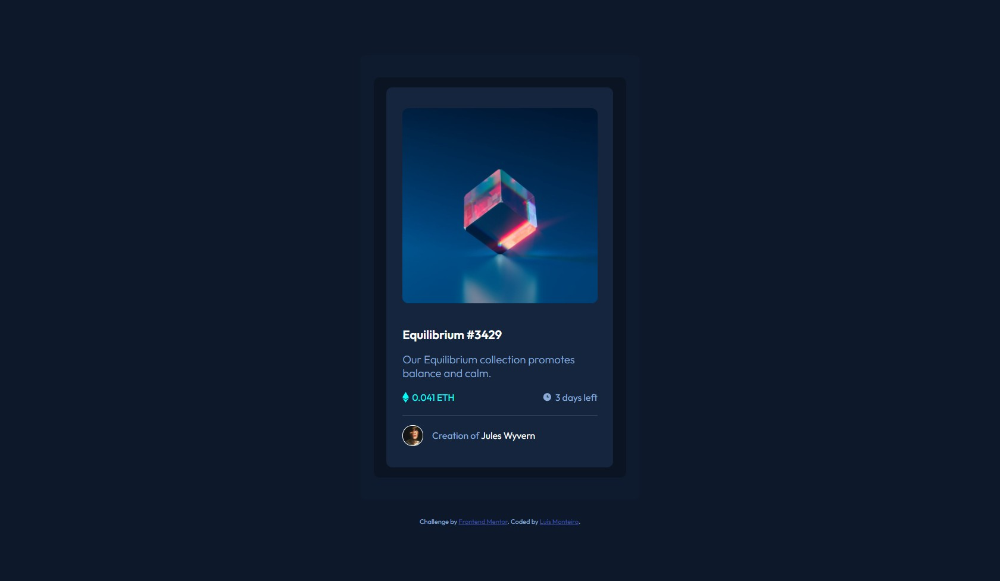

# Frontend Mentor - NFT preview card component solution

This is a solution to the [NFT preview card component challenge on Frontend Mentor](https://www.frontendmentor.io/challenges/nft-preview-card-component-SbdUL_w0U). Frontend Mentor challenges help you improve your coding skills by building realistic projects.

## Table of contents

- [Overview](#overview)
  - [The challenge](#the-challenge)
  - [Screenshot](#screenshot)
  - [Links](#links)
- [My process](#my-process)
  - [Built with](#built-with)
  - [What I learned](#what-i-learned)
  - [Continued development](#continued-development)
- [Author](#author)
- [Acknowledgments](#acknowledgments)

**Note: Delete this note and update the table of contents based on what sections you keep.**

## Overview

### The challenge

Users should be able to:

- View the optimal layout depending on their device's screen size
- See hover states for interactive elements

### Screenshot

### Links

- Solution URL: [Solution URL](https://github.com/lmonteiro18/frontendmentor-nftPreviewCardComponent)
- Live Site URL (Heroku): [Live site URL](https://fm-nft-preview-card-challenge.herokuapp.com/)

## My process

### Built with

- Semantic HTML5 markup
- CSS custom properties
- Flexbox
- Desktop-first workflow
- Node JS (for backend and to deploy on heroku)

### What I learned

This was my first Frontend Mentor Challenge even though I already have some experience in this area.
I tried to use classes with single styles so that I could reuse them and apply them to various elements without having to add individual styles for each one of them. I also tried to make the page responsive for a wide range of devices (besides the dimensions presented in the style-guide).
I could probably have created a component using a pure JavaScript function but since the aim of this challenge was practicing HTML and CSS and also the card wasn't going to be reused elsewhere I decided not to (I could also have used React JS but I haven't learned about that framework yet).
Edit: After some suggestions made by other users i learned some new things, like not to use 100vh in a global element like body because things will get disformed, or how to use aria hidden to hide decorative images from text-reader, or righting proper alt attributes. Also i learned how to use box-shadow.

### Continued development

I want to try to write CSS in a more organized way because most of the time I create a bunch of non-reusable classes and probably if another developer had to work over my code it would probably take him a lot of time to find the desired classes. That said i would like to learn more about CSS methodologies like BEM which i do not quite understand yet.

## Author

- Frontend Mentor - [@lmonteiro18](https://www.frontendmentor.io/profile/lmonteiro18)
- Behance - [@luismonteiro99](https://www.behance.net/luismonteiro99)
- Linkedin - [@luismonteiro99](https://www.linkedin.com/in/luismonteiro99/)

## Acknowledgments

@pikapikamart
@techanthere
@Nam-Hai

Thanks for the suggestions!
